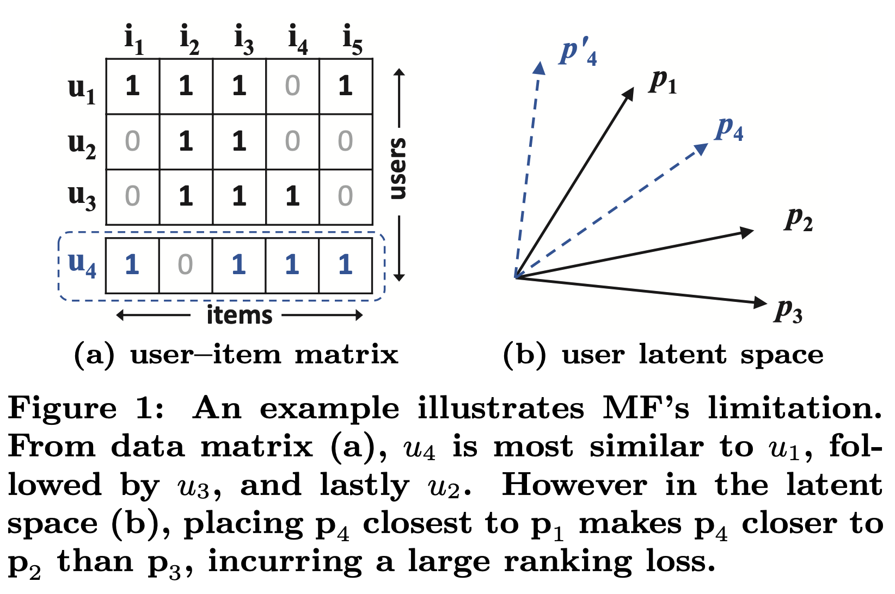
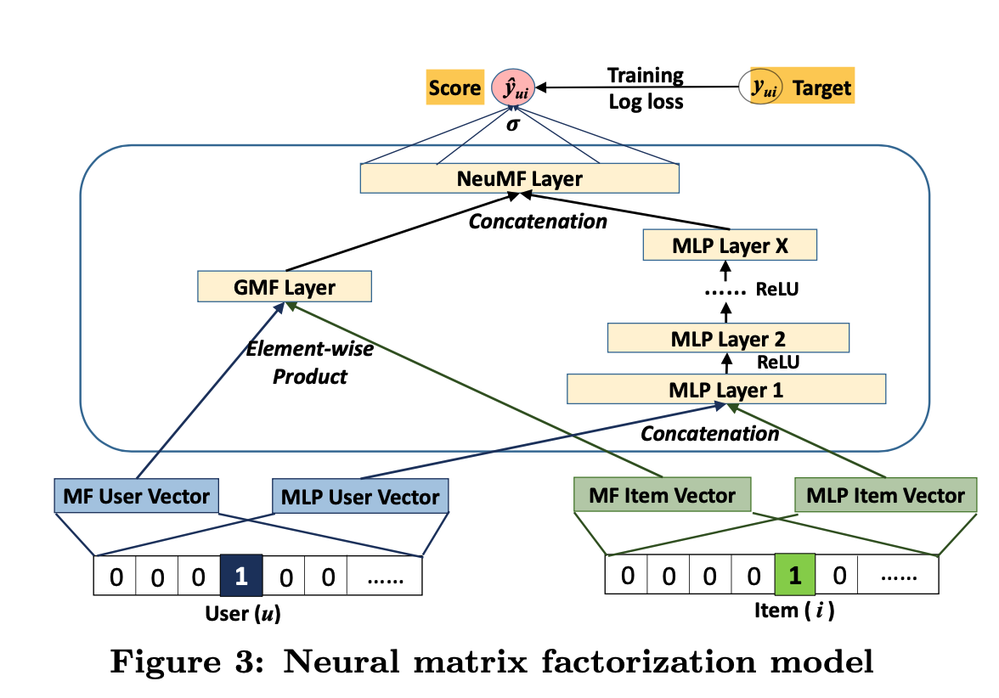
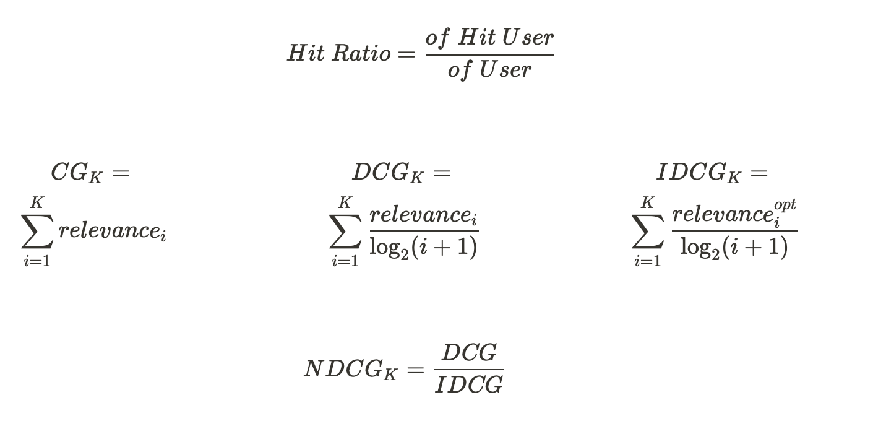

### NCFML (Neural Collaborative Filtering with MovieLens in torch)
### Dataset

Matrix Factorization에서 사용한 MovieLens dataset을 동일하게 사용한다. rating 점수와 같은 explicit feedback을 user-item interaction 만을 의미하는 implicit feedback로 만들기 위해 rating column을 모두 1로 전처리하였다. 0은 rating을 하지 않은 것에 불과하지만, 본 논문에서는 0을 negative feedback으로 가정한다. 따라서 user-item의 interaction이 없는 0을 의미하는 negative feedback sample들을 만들기 위해 전치리를 진행하였다. (negative feedback에 대한 sampling의 비율은 논문에서 명시한 값을 사용)

### model

- 기존의 딥러닝을 추천시스템에 적용한 연구들은 model에 추가적인 feature를 전달하기 위한 방법으로만 사용하고, latent factor에 대해서는 Matrix Factorization에 의존한다.

    기존의 Matrix Factorization의 한계점은 user-item의 interaction을 linear한 방식(fixed dot product)으로 계산하기 때문에, ranking loss가 생긴다.

    <p align="center">
    <div class="center">
      <figure>
        <a href="/images/matrix_limit.png"></a>
      </figure>
    </div>
    </p>

     latent factor들을 latent space에서 표현했을때, cosine similarity가 실제 matrix의 factor의 양상과 일치하지 않는것을 확인할 수 있다.(user 4를 user 1과 가장 유사하면서 user 3보다 user 2가 덜 유사한 $p_4$를 나타낼 수 없다.)

- 따라서 본 논문에서는 MF의 한계점을 보완하기 위해서 MLP를 사용한다. user-item의 interaction에 대해서 non-linear한 방식으로도 학습하기 위해 MLP를 사용하며, 기존의 Matrix Factorization의 linear한 factor도 사용하기 위해 GMF(Generalized Matrix Factorization)를 MLP와 concatenate하여 NeuMF를 만들었다.

  <p align="center">
  <div class="center">
    <figure>
      <a href="/images/NeuMF.png"></a>
    </figure>
  </div>
  </p>

- 이때, MLP, GMF를 concatenate하면 objective function이 non-convex하기 때문에 local optima로 optimize된다. 따라서 본 논문에서는 pre-trained MLP, pre-trained GMF를 이용하여 마지막 output layer만을 SGD를 통해 optimize한다. (MLP, GMF는 Adam optimizer로 optimize한다. NeuMF에서 Adam을 사용하지 못하는 이유는 pre-trained model을 사용하므로 momentum에 대한 정보가 없기 때문이다.)

### NeuMF model overview


### Neural Collaborative Filtering model directory tree

```python
.
├── README.md
├── evaluation.py
├── main.py
├── model
│   ├── GMF.py
│   ├── MLP.py
│   └── NeuMF.py
├── pretrain
├── train.py
└── utils.py
```

### development enviroment

- OS: Max OS X
- IDE: pycharm, gpu sever computer에서는 vim을 사용
- GPU: NVIDIA RTX A6000 8

### Quick start

```python
python main.py --epoch 30 --batch 256 --factor 8 --model NeuMF -pr False --topk 10 --file_size 100k --layer 64 32 16 --download True --use_pretrain False
```

### Metric

Recommendation System에서는 모델의 정확도보다 user에게 얼마나 다양하고, 새롭고, 참신한 item을 선택해주는지가 model의 성능을 평가하는 기준이 된다.

- HR@K : Dataset상에 각 user마다 선호하는 item 중 1개를 제외하고 학습시킨 뒤, user별로 K개의 item을 추천해주고, 전처리과정에서 제외한 item이 추천해준 item K개 안에 포함되면 Hit으로 판단한다.

<p align="center">
<div class="center">
  <figure>
    <a href="/images/Metric.png"></a>
  </figure>
</div>
</p>

## Neural Collaborative Filtering Result

| movielens 100K | HR | NDCG | Runtime |
| --- | --- | --- | --- |
| GMF | 0.756 | 0.504 | 44m |
| MLP | 0.805 | 0.530 | 2h 40m |
| NeuMF (without pre-training) | 0.970 | 0.627 | 3h 20m |

| movielens-1M | HR | NDCG | Runtime |
| --- | --- | --- | --- |
| GMF | 0.619 | 0.353 | 20m |
| MLP | 0.602 | 0.343 | 1h 25m |
| NeuMF (without pre-training) | 0.668 | 0.393 | 2h |

# development enviroment

- OS: Max OS X
- IDE: pycharm, gpu sever computer에서는 vim을 사용
- GPU: NVIDIA RTX A6000 8대


reference : [Neural Collaborative Filtering](https://arxiv.org/abs/1708.05031)

review written in korean : [Review](https://changhyeonnam.github.io/2021/12/28/Neural_Collaborative_Filtering.html)

Neural Collaborative Filtering with MovieLenws in torch
